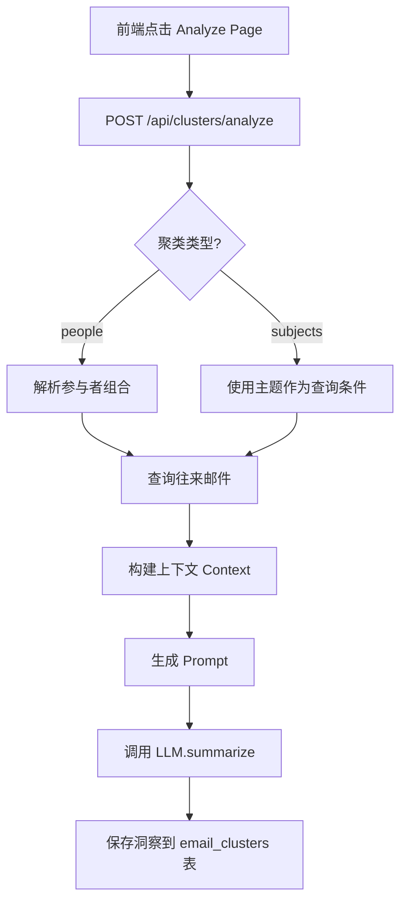

# 系统架构 (Architecture)

## 系统概览
本项目采用 **B/S 架构** 的变体——**本地服务器架构**。
前端作为用户界面，后端作为本地服务运行在用户机器上，负责繁重的文件 I/O 和数据处理。

```mermaid
graph TD
    User[用户] --> UI[前端 UI (React)]
    UI -- API/Stream --> Server[本地后端 (FastAPI)]
    
    subgraph Local Environment
        Server -- 写入 --> FS[文件系统 (原始文件)]
        Server -- 导入/查询 --> DB[(DuckDB/SQLite)]
        Server -- 调用 --> AI_Adapter[AI 适配层]
        Server -- 清洗 --> Dedup[去重服务 (EmailDedupService)]
    end
    
    subgraph External Cloud
        AI_Adapter -- API --> Gemini[Google Gemini]
        AI_Adapter -- API --> Azure[Azure OpenAI]
    end
```

## 模块设计

### 1. 数据摄入模块 (Ingestion Service)
- **流式上传**: 采用流式（Chunked） 接收前端上传的大文件，避免内存溢出 (OOM)。
- **分块处理**: 对于 1GB+ 文件，不一次性加载进内存，而是使用 Pandas chunksize 或 DuckDB 直接读取 CSV 功能。

### 2. 存储模块 (Storage Service)
- **文件管理**: 统一管理 `data/uploads/` 目录。
- **任务隔离**: 每个任务可能有独立的 Table 或 View，或者在主表中通过 `task_id` 区分。
- **清理机制 (Cleaner)**: 删除任务时，执行原子操作：
  1. 删除数据库记录 (`DELETE FROM ... WHERE task_id = ?`)
  2. 删除关联的物理文件。

### 3. 数据处理模块 (Data Processing)
- **Email Dedup Service**: 
  - 集成 `email-reply-parser` 库
  - 自动识别并去除邮件中的引用回复 (Quotes) 和签名 (Signatures)
  - 构建去重后的上下文，最大化 Token 利用率

### 4. AI 编排模块 (AI Orchestrator)
- **统一接口**: 定义 `AIServiceBase` 抽象基类，规范所有 AI 服务提供商接口
- **Gemini 实现**: 封装 `google.generativeai`，支持摘要、情感分析、实体提取
- **Azure 实现**: 封装 `openai.AzureOpenAI`，提供相同的分析能力
- **配置管理**: 从环境变量读取 API Keys（`GEMINI_API_KEY`, `AZURE_OPENAI_KEY`, `AZURE_ENDPOINT`）
- **Prompt 工程**: 为每种分析类型设计专业的 Prompt 模板

### 4. 分析 API 模块 (Analysis API)
- **分析端点**:
  - `POST /api/analysis/summarize` - 生成邮件摘要和关键点
  - `POST /api/analysis/sentiment` - 情感分析（positive/negative/neutral）
  - `POST /api/analysis/entities` - 实体提取（人名、组织、地点、日期等）
- **结果缓存**: 将分析结果保存到 `analysis_results` 表，避免重复调用
- **模型切换**: 支持前端动态选择使用 Gemini 或 Azure OpenAI

## 数据库设计 (Database Schema)

### `tasks` 表
| 字段 | 类型 | 说明 |
| :--- | :--- | :--- |
| id | UUID | 任务唯一标识 |
| name | TEXT | 任务名称 |
| status | TEXT | 状态 (PENDING, PROCESSING, DONE) |
| created_at | DATETIME | 创建时间 |
| file_path | TEXT | 原始文件及其路径 |

### `emails` 表 (邮件记录表)
| 字段 | 类型 | 说明 |
| :--- | :--- | :--- |
| id | INTEGER | 主键，自增 ID |
| task_id | UUID | 外键，关联 tasks.id |
| sender | TEXT | 发件人邮箱 |
| receiver | TEXT | 收件人邮箱 |
| subject | TEXT | 邮件主题 |
| content | TEXT | 邮件正文内容 |
| timestamp | DATETIME | 邮件时间戳 |

### `analysis_results` 表 (AI 分析结果表)
| 字段 | 类型 | 说明 |
| :--- | :--- | :--- |
| analysis_id | UUID | 主键，分析记录唯一标识 |
| task_id | UUID | 外键，关联 tasks.id |
| email_id | INTEGER | 外键，关联 emails.id |
| analysis_type | TEXT | 分析类型 (summary/sentiment/entities) |
| model_provider | TEXT | 使用的 AI 模型 (gemini/azure) |
| result | TEXT | JSON 格式的分析结果 |
| created_at | DATETIME | 分析时间 |

### `email_clusters` 表 (聚类分析结果表)
| 字段 | 类型 | 说明 |
| :--- | :--- | :--- |
| id | UUID | 主键，聚类记录唯一标识 |
| task_id | UUID | 外键，关联 tasks.id |
| cluster_type | TEXT | 聚类类型 (people/subjects) |
| cluster_key | TEXT | 聚类键（往来组合 or 主题） |
| ai_insight | TEXT | AI 生成的洞察摘要 |
| model_provider | TEXT | 使用的 AI 模型 (gemini/azure) |
| analyzed_at | DATETIME | 分析时间 |

## 关键流程

### 大文件处理流程
1. 前端通过 `Multipart` 上传。
2. 后端 `UploadFile` 接收流，以 `wb` 模式分块写入磁盘。
3. 写入完成后，触发 DuckDB `COPY` 命令或 `read_csv` 将数据这一部分导入数据库（利用 DuckDB 的零拷贝或高效导入特性）。

### 聚类分析 LLM 调用流程



#### 1. 邮件获取
```python
# 往来聚类：查询两个参与者之间的邮件
emails = db.get_emails_by_participants(task_id, participant1, participant2, limit=10)

# 主题聚类：查询相同主题的邮件
emails = db.get_emails_by_subject(task_id, subject, limit=10)
```

#### 2. 上下文构建（Token 控制）
```python
# 使用去重服务构建智能上下文
from services.email_dedup_service import EmailDedupService
context = EmailDedupService.build_deduped_context(emails)
```

#### 3. Prompt 模板
```python
prompt = f"""基于以下邮件往来，生成一个简洁的中文洞察摘要（50字以内），包括：
1. 主要话题/主题
2. 交流特点或关系
3. 关键信息点

邮件内容：
{context}

请直接输出摘要，不要有多余的前缀或解释。"""
```

#### 4. 关键参数设计

| 参数 | 数值 | 设计原因 |
|------|------|----------|
| 邮件数量 (Analysis) | 20 封 | 去重后可容纳更多邮件 |
| 邮件数量 (Chat) | 50 封 | 支持更长的对话历史分析 |
| 内容处理 | 去引用/去签名 | 消除重复内容，保留核心信息 |
| 摘要长度 | 50 字以内 | 适合表格列展示 |


## 文件结构与说明

### 后端文件 (Backend)

#### `backend/main.py`
**作用**：FastAPI 应用主入口
- 初始化 FastAPI 应用
- 配置 CORS 中间件（允许跨域请求）
- 注册任务 API 路由
- 提供健康检查端点

#### `backend/services/db_service.py`
**作用**：数据库服务层，管理所有数据库操作
- **DuckDB 连接管理**：单例模式，确保全局唯一连接
- **Schema 初始化**：创建 `tasks` 和 `emails` 表
- **智能 CSV 导入**：
  - 自动检测CSV列名（支持 sender/from/from_email 等变体）
  - 使用 `read_csv_auto` 自动识别分隔符和数据类型
  - 使用 `TRY_CAST` 处理日期转换，避免格式错误
- **CRUD 操作**：任务和邮件的增删改查
- **Datetime 序列化**：将数据库返回的 datetime 对象转换为 ISO 字符串

#### `backend/services/storage_service.py`
**作用**：文件存储服务，处理大文件上传和管理
- **流式上传**：使用 `shutil.copyfileobj` 以 1MB 块大小分块写入，支持 GB 级文件
- **任务隔离**：每个任务有独立的文件目录
- **清理机制**：删除任务时同步删除所有相关文件

#### `backend/api/task_api.py`
**作用**：任务管理 REST API
- **POST /api/tasks/**：创建任务，接收 FormData（name + file），使用后台任务异步处理导入
- **GET /api/tasks/**：获取所有任务列表
- **GET /api/tasks/{id}**：获取单个任务详情
- **DELETE /api/tasks/{id}**：级联删除任务（数据库记录 + 磁盘文件）
- **GET /api/tasks/{id}/emails**：分页获取任务的邮件记录（返回格式：`{"emails": [...], "limit": ..., "offset": ...}`）

#### `backend/services/ai/ai_base.py`
**作用**：AI 服务抽象基类
- **AIServiceBase 抽象类**：定义统一的 AI 服务接口
- **三个核心方法**：`summarize()`, `analyze_sentiment()`, `extract_entities()`
- **强制实现**：所有 AI 提供商必须实现这三个方法

#### `backend/services/ai/gemini_service.py`
**作用**：Google Gemini AI 服务实现
- **继承 AIServiceBase**：实现所有抽象方法
- **JSON 解析**：从 Gemini 响应中提取结构化数据
- **错误处理**：处理 API 调用失败和 JSON 解析异常
- **Prompt 优化**：针对 Gemini 模型特性设计 Prompt

#### `backend/services/ai/azure_service.py`
**作用**：Azure OpenAI 服务实现
- **继承 AIServiceBase**：实现所有抽象方法
- **OpenAI SDK 集成**：使用 `openai.AzureOpenAI` 客户端
- **响应格式统一**：将 Azure 响应转换为与 Gemini 一致的数据结构

#### `backend/services/email_dedup_service.py`
**作用**：邮件去重服务
- **EmailDedupService 类**：提供静态方法处理内容
- **clean_content()**：使用 `email-reply-parser` 去除引用和签名
- **build_deduped_context()**：构建去重后的上下文，支持最大字符数限制

#### `backend/api/analysis_api.py`
**作用**：邮件分析 REST API
- **POST /api/analysis/summarize**：生成摘要，返回 summary 和 key_points
- **POST /api/analysis/sentiment**：情感分析，返回 label (positive/negative/neutral) 和 score
- **POST /api/analysis/entities**：实体提取，返回人名、组织、地点、日期等实体列表
- **GET /api/analysis/results/{email_id}**：获取指定邮件的所有分析结果
- **动态模型选择**：根据请求参数选择 Gemini 或 Azure
- **结果持久化**：将分析结果保存到 `analysis_results` 表

#### `backend/api/stats_api.py`
**作用**：统计 API，为 Dashboard 提供数据
- **GET /api/stats/{task_id}**：返回邮件总数、时间范围、Top 发件人、邮件趋势

#### `backend/api/people_api.py`
**作用**：人员名录 API
- **GET /api/people/{task_id}**：联系人列表（按发件人聚合统计）
- **GET /api/people/{task_id}/emails**：指定联系人的邮件往来

#### `backend/api/chat_api.py`
**作用**：智能洞察 Chat API
- **POST /api/chat/**：基于邮件数据的 AI 问答
- **上下文获取**：直接获取最近邮件作为 AI 上下文
- **双模型支持**：Gemini 2.0 Flash 和 Azure OpenAI
- **环境变量**：`GEMINI_API_KEY`、`AZURE_OPENAI_API_KEY`、`AZURE_OPENAI_ENDPOINT`、`AZURE_OPENAI_DEPLOYMENT_NAME`

### 前端文件 (Frontend)

#### `frontend/src/App.tsx`
**作用**：主应用组件，实现任务管理界面
- **任务创建表单**：支持文件选择和上传
- **任务列表**：显示任务状态（带颜色标识）
- **功能入口**：仪表盘、名录、分析、问答四个按钮
- **删除功能**：带确认对话框的任务删除
- **API 交互**：使用 Axios 与后端通信

#### `frontend/src/components/EmailAnalyzer.tsx`
**作用**：邮件分析主界面组件
- **三栏布局**：邮件列表 | 邮件详情 | 分析结果
- **邮件选择**：点击邮件列表项查看详情和分析
- **模型切换**：支持在 Gemini 和 Azure 之间切换
- **三种分析功能**：
  - 📄 生成摘要：提取邮件核心内容和关键点
  - 😊 情感分析：识别邮件的情感倾向和置信度
  - 🏷️ 实体提取：提取人名、组织、地点等关键实体
- **结果展示**：美观的卡片式展示，区分不同分析类型
- **加载状态**：分析过程中显示加载动画
- **数据修复**：正确处理后端 API 返回的 `{"emails": [...]}` 格式

#### `frontend/src/components/InsightChat.tsx`
**作用**：智能洞察聊天组件
- **聊天界面**：消息气泡展示对话历史
- **模型切换**：下拉框选择 Gemini 或 Azure
- **上下文显示**：显示 AI 引用的相关邮件
- **对话管理**：清空对话功能

#### `frontend/src/pages/Dashboard.tsx`
**作用**：数据仪表盘页面
- **核心指标卡片**：邮件总数、时间跨度、联系人数量
- **邮件趋势图**：CSS 柱状图展示按日期分组的邮件数量
- **Top 发件人**：排行榜样式展示，带进度条可视化

#### `frontend/src/pages/PeopleDirectory.tsx`
**作用**：人员名录页面
- **联系人列表**：带搜索功能的联系人展示
- **头像生成**：根据邮箱首字母生成彩色头像
- **邮件往来**：点击联系人查看其所有邮件

#### `frontend/vite.config.ts`
**作用**：Vite 构建配置
- 配置 React 插件
- 设置 API 代理（`/api` → `http://localhost:8000`）

## 关键技术决策

### 1. 为什么使用 DuckDB？
- **OLAP 优化**：专为分析查询设计，处理大数据集性能优异
- **嵌入式**：无需独立服务器，简化部署
- **CSV 导入优化**：`read_csv_auto` 提供近乎零拷贝的导入性能
- **SQL 兼容**：标准 SQL 语法，易于维护

### 2. 流式上传的实现
使用 `shutil.copyfileobj(file, f, length=1024*1024)` 而不是 `file.read()`：
- **内存安全**：1GB 文件只占用约 1MB 内存
- **性能**：分块写入避免系统调用开销
- **可靠性**：支持断点续传（未来可扩展）

### 3. 智能 CSV 列映射
支持多种列名变体（如 sender/from/from_email），提高兼容性：
- **用户友好**：不强制特定格式
- **健壮性**：使用 `TRY_CAST` 处理日期，失败时返回 NULL
- **可扩展**：易于添加新的列名映射规则